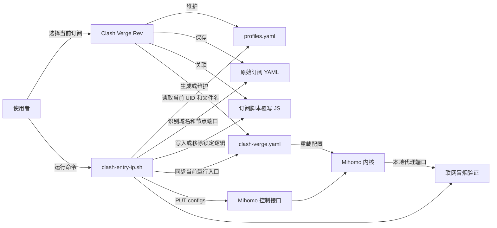
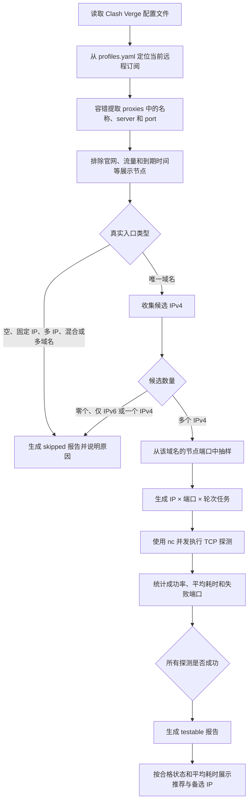
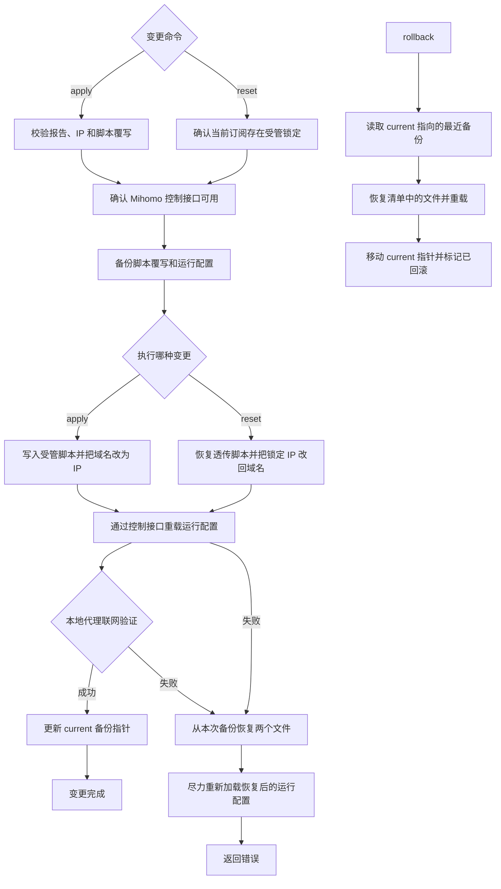

# `clash-entry-ip.sh` 工作原理

本文面向 `clash-entry-ip.sh` 的使用者和维护者，解释它为什么存在、如何与
Clash Verge Rev 和 Mihomo 配合，以及每个命令会读取或修改哪些内容。

> 本文只描述 macOS 上的 `clash-entry-ip.sh`。Android 的
> `cfa-entry-ip.sh` 处理导出的 YAML 副本，不连接 Clash Verge，也不会修改
> 本机正在运行的代理配置。

## 1. 它解决什么问题

部分代理订阅让许多节点共用同一个入口域名。该域名可能同时解析到多个 IPv4，
但这些地址到不同节点端口的可用性或稳定性并不一致。DNS 在多个地址之间漂移时，
客户端可能偶发连接到不可用入口。

`clash-entry-ip.sh` 的处理方式是：

1. 找出当前订阅唯一的真实入口域名；
2. 从多个 DNS 视角收集它的候选 IPv4；
3. 对候选 IP 和代表性节点端口进行多轮 TCP 探测；
4. 只允许将全部探测成功的 IP 应用到当前订阅；
5. 通过 Clash Verge 的脚本覆写保持锁定，并让 Mihomo 立即加载修改后的运行配置。

它不是通用的 Clash 配置编辑器，也不会替用户自动选择并应用 IP。诊断和应用被
刻意拆成两个命令，使用者必须先查看报告，再明确执行 `apply <IPv4>`。

## 2. Clash Verge、Mihomo 与脚本的关系

Clash Verge Rev 是配置和订阅的管理层；Mihomo 是实际执行代理规则、监听本地端口
并建立代理连接的内核。`clash-entry-ip.sh` 不替代任何一方，而是读取 Clash Verge
维护的文件，并通过 Mihomo 控制接口让变更立即生效。



### 为什么同时修改脚本覆写和运行配置

脚本覆写决定 Clash Verge 今后处理该订阅时，是否继续把目标域名替换成固定 IP；
它解决的是“持续生效”。`clash-verge.yaml` 是当前运行配置，直接修改并调用 Mihomo
控制接口重载，可以让本次变更立即生效。只改其中一个，会出现当前运行状态与后续
订阅处理结果不一致的窗口。

## 3. 文件与状态模型

Clash Verge 应用目录默认为：

```text
$HOME/Library/Application Support/io.github.clash-verge-rev.clash-verge-rev
```

| 内容 | 默认位置 | 脚本用途 | 是否修改 |
| --- | --- | --- | --- |
| Clash Verge 基础配置 | `config.yaml` | 读取 Mihomo 控制地址、Unix Socket 或密钥的后备值 | 否 |
| 订阅索引 | `profiles.yaml` | 从 `current` 定位当前远程订阅、原始文件和脚本覆写文件 | 否 |
| 当前订阅原始 YAML | `profiles/<订阅文件>` | 识别节点入口、端口，并计算订阅指纹 | 否 |
| 当前订阅脚本覆写 | `profiles/<脚本文件>` | `apply` 写入域名到 IP 的受管转换；`reset` 恢复透传逻辑 | 是 |
| Mihomo 当前运行配置 | `clash-verge.yaml` | 读取 DNS、控制接口和本地端口；同步当前入口并重载 | 是 |
| 完整诊断报告 | 项目 `reports/` | 保存每个候选 IP 的测试结果 | 新建 |
| 最近报告索引 | 项目 `.state/latest-report.tsv` | 供 `status` 和 `apply` 校验 | 新建或覆盖 |
| 变更备份 | 应用目录 `entry-ip-backups/` | 保存变更前的脚本覆写、运行配置和清单 | 新建 |
| 最近备份指针 | `entry-ip-backups/current` | 指向最近一次成功变更的备份，供 `rollback` 使用 | 新建或移动 |

报告和状态文件可能包含订阅名称、域名、候选 IP 和本地路径；备份中还包含完整运行
配置。不要公开上传这些目录。仓库默认已忽略项目内的报告和状态文件。

## 4. `diagnose`：从订阅到可应用报告

```bash
./clash-entry-ip.sh diagnose
```

`diagnose` 是只读诊断流程，不修改 Clash Verge 或 Mihomo 配置。



### 4.1 定位当前订阅

脚本读取 `profiles.yaml`，找到 UID 等于 `current` 且类型为 `remote` 的项目，再沿
它的 `option.script` 找到类型为 `script` 的脚本覆写。由此得到：

- 当前订阅 UID 和名称；
- 原始订阅文件名；
- 与该订阅关联的脚本覆写文件名。

因此，诊断对象始终是 Clash Verge 中当前选中的远程订阅，而不是目录中的任意
YAML。切换订阅后必须重新诊断。

### 4.2 节点提取与入口分类

原始订阅可能包含严格 YAML，也可能包含带额外冒号的行内节点。为提高兼容性，
脚本没有直接解析整份 YAML，而是在 `proxies` 区域容错提取块状和行内节点的
`name`、`server`、`port`。

名称包含官网地址、剩余流量、套餐时间、到期时间等特征的展示节点不会参与入口
判断。其余节点按 `server` 汇总后，只接受“所有真实节点共用一个域名”的情况。

以下分类会生成 `skipped` 报告，不进入应用阶段：

| 分类 | 跳过原因 |
| --- | --- |
| 没有真实节点 | 无法检测有效代理入口 |
| 单个固定 IP | 已经没有多 IP DNS 漂移问题 |
| 多个固定 IP | 无法安全归并成一个入口 |
| 域名与 IP 混合 | 无法确认统一替换目标 |
| 多个域名 | 不能用一个 IP 统一锁定不同入口 |

### 4.3 候选 IPv4 的来源

脚本合并并去重以下查询结果，同时记录每个地址的来源：

- 系统默认 DNS：`dig +short A <域名>`；
- macOS DNS 缓存：`dscacheutil -q host -a name <域名>`；
- Mihomo 运行配置中 `nameserver`、`default-nameserver` 和
  `proxy-server-nameserver` 里出现的字面量 IPv4 DNS；
- 从入口域名推导出的根域权威 NS，再直接向权威 DNS 查询 A 记录。

如果没有 IPv4，脚本会额外查询 AAAA，以区分“仅 IPv6”和“没有有效地址”。如果
最终只有一个 IPv4，也会跳过，因为此时不存在需要选择和锁定的多 IP 漂移风险。

### 4.4 端口抽样与严格判定

测试端口来自使用目标域名的真实节点。默认最多选择 12 个代表性端口，按照排序后
的位置均匀抽取；如果存在端口 `9051`，会强制把它纳入样本。

每个“候选 IP × 样本端口”默认测试 5 次。探测使用 `nc` 建立 TCP 连接，任务由
`xargs -P` 并发执行，默认最大并发数为 8。只有某个 IP 的每一次、每个端口探测
都成功，它的 `eligible` 才是 `yes`。这是一项有意设置的严格门槛，而不是按多数
成功或最低成功率放行。

报告记录成功次数、总次数、成功率、平均耗时、失败端口和 DNS 来源。合格地址按
平均耗时展示，第一项作为推荐 IP，其余作为可用备选；脚本不会自动执行推荐项。

### 4.5 报告为何不能永久复用

`apply` 使用最近报告前会再次校验：

- 报告状态必须为 `testable`；
- 默认生成时间不超过 30 分钟；
- 当前订阅 UID 必须与报告一致；
- 原始订阅文件的 SHA-256 指纹必须与诊断时一致；
- 指定 IP 必须出现在报告中且 `eligible=yes`。

这些约束防止把旧订阅、旧 DNS 状态或其他订阅的结果应用到当前配置。

## 5. `apply`：持续锁定一个合格 IP

```bash
./clash-entry-ip.sh apply 198.51.100.20
```

通过报告校验后，`apply` 先确认当前脚本覆写是标准透传脚本，或已经包含本工具的
受管标记。存在其他自定义逻辑时会拒绝覆盖。

写入的受管脚本逻辑等价于：遍历 `config.proxies`，只把 `server` 严格等于目标
域名的节点改成指定 IP，其他节点和字段原样返回。受管标记以及脚本中的 `domain`
和 `pinnedIp` 也供 `status`、后续 `apply` 和 `reset` 识别。

当前运行配置中的同一入口会同步替换，随后通过 Mihomo 控制接口重新加载。最后，
脚本使用 `mixed-port`（缺省时使用 `7897`）作为本地 HTTP 代理访问
`https://www.google.com/generate_204`，只有获得 2xx 或 3xx 响应才认为应用成功。

## 6. 配置变更是一项可恢复事务

`apply` 和 `reset` 使用相同的安全边界：先确认 Mihomo 控制接口可用，再备份，
然后修改文件、重载并验证。备份目录精确保存变更前的脚本覆写和运行配置，并用
`manifest.tsv` 记录恢复目标。原子替换通过“写临时文件，再 `mv` 到目标路径”完成。



控制接口优先使用 `external-controller-unix` 指定的 Unix Socket；不可用时再尝试
`external-controller` 指定的 TCP 地址。TCP 接口如果配置了有效 `secret`，请求会
携带 Bearer Token。相关值优先从当前运行配置读取，再以基础配置作为后备。

## 7. `reset` 与 `rollback` 的区别

### `reset`：取消入口锁定

```bash
./clash-entry-ip.sh reset
```

`reset` 从受管脚本读出原始域名和当前锁定 IP，将运行配置中匹配的锁定 IP 改回
域名，并把订阅脚本覆写恢复为标准透传函数。它不会把整份旧运行配置覆盖回来，
所以锁定期间出现的其他订阅更新可以保留。

如果当前订阅没有本工具的受管标记，`reset` 不修改任何文件，提示无需恢复并以
成功状态退出。成功的 `reset` 自身也会创建备份，因此可以再用 `rollback` 撤销。

### `rollback`：撤销最近一次成功变更

```bash
./clash-entry-ip.sh rollback
```

`rollback` 不理解“域名”和“IP”的业务含义，只按最近备份的 `manifest.tsv` 恢复
文件快照。因此：

- 在 `apply` 后执行，会回到该次应用之前；
- 在 `reset` 后执行，会回到取消锁定之前，即重新得到原来的锁定状态；
- 它只撤销最近一次成功变更，不是任意深度的历史版本管理器。

恢复后，`current` 指针会移动到对应备份目录并带上回滚时间，防止重复回滚同一项。

## 8. `status`：查看状态但不证明远端可用

```bash
./clash-entry-ip.sh status
```

`status` 显示当前订阅、原始配置文件、受管脚本中的锁定关系、Mihomo 控制接口是否
可达，以及最近诊断报告的概要。它不会重新执行 DNS 查询或 TCP 探测，因此不能用
来证明某个入口 IP 此刻仍然可用；需要刷新判断时应重新执行 `diagnose`。

## 9. 命令的输入、前置条件和副作用

| 命令 | 主要前置条件 | 输出 | 配置副作用 |
| --- | --- | --- | --- |
| `diagnose` | 当前远程订阅完整；具备 DNS 和探测命令 | 完整报告、最近报告索引、推荐与备选 | 不修改 Clash 配置 |
| `apply <IPv4>` | 新鲜且匹配当前订阅的可应用报告；IP 全部测试成功；脚本覆写安全 | 备份、受管脚本、更新后的运行配置 | 锁定当前订阅并重载 Mihomo |
| `status` | Clash Verge 关键配置文件存在 | 当前锁定、控制接口和报告概要 | 无 |
| `reset` | 当前订阅包含本工具的受管锁定；控制接口可用 | 备份、透传脚本、恢复域名的运行配置 | 取消锁定并重载 Mihomo |
| `rollback` | 存在最近成功变更的备份指针；控制接口可用 | 恢复的文件和备份位置 | 恢复最近文件快照并重载 Mihomo |

## 10. 环境变量与默认值

路径变量主要用于适配安装位置和隔离测试；测试参数用于控制诊断成本。

| 环境变量 | 默认值或含义 |
| --- | --- |
| `CLASH_APP_DIR` | Clash Verge 默认应用目录 |
| `CLASH_RUNTIME_CONFIG` | `$CLASH_APP_DIR/clash-verge.yaml` |
| `CLASH_BASE_CONFIG` | `$CLASH_APP_DIR/config.yaml` |
| `CLASH_PROFILES_CONFIG` | `$CLASH_APP_DIR/profiles.yaml` |
| `CLASH_ENTRY_STATE_DIR` | 项目 `.state/` |
| `CLASH_ENTRY_REPORT_DIR` | 项目 `reports/` |
| `CLASH_ENTRY_BACKUP_DIR` | `$CLASH_APP_DIR/entry-ip-backups` |
| `CLASH_ENTRY_REPORT_TTL` | 报告有效期，默认 `1800` 秒 |
| `CLASH_ENTRY_TEST_ROUNDS` | 每个 IP 与端口的测试轮次，默认 `5` |
| `CLASH_ENTRY_SAMPLE_PORTS` | 最多抽样端口数，默认 `12` |
| `CLASH_ENTRY_CONNECT_TIMEOUT` | 单次 TCP 连接超时，默认 `3` 秒 |
| `CLASH_ENTRY_MAX_CONCURRENCY` | 最大并发探测数，默认 `8` |

脚本依赖 macOS/BSD 用户空间以及 `ruby`、`dig`、`nc`、`perl`、`xargs`、
`shasum`、`curl`、`awk`、`sed` 等命令。诊断阶段和修改阶段会按实际需要检查关键
依赖，缺失时直接报错，不会继续执行部分操作。

## 11. 安全边界与已知限制

- 只支持 IPv4 候选；仅有 IPv6 时会跳过。
- 只处理真实节点共用单一入口域名的订阅，不尝试为多域名分别选 IP。
- 节点提取只关注 `proxies`，运行配置替换以块状 `server:` 行为目标。
- TCP 探测证明目标端口可建立连接，不等价于完整代理协议握手；应用后的联网冒烟
  验证用于补上端到端检查。
- 严格的全成功门槛降低误选风险，但瞬时网络抖动可能让可用地址暂时不合格。
- 脚本覆写只有在标准透传或已由本工具管理时才允许覆盖，避免破坏用户自定义逻辑。
- 运行配置和备份可能包含代理凭据，不应提交、分享或放入不受信任的位置。
- 直接手工修改受管脚本中的标记、`domain` 或 `pinnedIp` 可能导致 `status`、
  `apply` 或 `reset` 无法正确识别状态。
- `rollback` 依赖最近备份中的绝对目标路径；移动 Clash Verge 应用目录后，旧备份
  不应继续用于恢复。

## 12. 源码函数职责索引

以下按职责列出关键函数，便于阅读源码时定位，不绑定具体行号。

| 分组 | 关键函数 | 职责 |
| --- | --- | --- |
| 基础校验 | `check_files`、`need`、`is_ipv4`、`fingerprint` | 检查文件和命令、验证 IPv4、生成订阅指纹 |
| 订阅定位 | `current_profile` | 解析当前远程订阅及其脚本覆写关系 |
| 节点分析 | `extract_nodes`、`classify` | 容错提取节点并判断入口结构是否可安全锁定 |
| 地址发现 | `nameservers`、`discover` | 汇总系统、缓存、Mihomo DNS 和权威 DNS 的 IPv4 |
| 网络探测 | `select_ports`、`probe`、`run_tasks` | 选择端口、执行单次连接、并发调度任务 |
| 报告管理 | `header`、`publish`、`skip`、`rv` | 生成报告、发布最近结果和读取报告字段 |
| 应用前校验 | `validate`、`safe_script`、`managed` | 防止使用过期报告、错误订阅或覆盖自定义脚本 |
| 配置转换 | `write_script`、`write_passthrough`、`transform`、`reset_transform` | 写受管或透传脚本，在域名与锁定 IP 间转换 |
| 控制接口 | `controller_init`、`request`、`tcp_req`、`reload` | 发现 Unix/TCP 控制接口并重载 Mihomo 配置 |
| 事务安全 | `new_backup`、`restore`、`smoke` | 创建唯一备份、原子恢复、执行端到端验证 |
| 用户命令 | `diagnose`、`apply_ip`、`reset_lock`、`status`、`rollback` | 实现命令行公开行为 |

## 13. 推荐操作顺序

```bash
# 1. 在 Clash Verge 中选中目标订阅后诊断
./clash-entry-ip.sh diagnose

# 2. 查看输出和 reports/ 中的详细报告，再明确应用合格 IP
./clash-entry-ip.sh apply 198.51.100.20

# 3. 随时查看当前受管状态
./clash-entry-ip.sh status

# 4. 不再需要锁定时，恢复订阅原始入口行为
./clash-entry-ip.sh reset

# 5. 如果需要撤销最近一次 apply 或 reset
./clash-entry-ip.sh rollback
```

订阅切换或更新、报告过期、DNS 结果变化，或者入口质量出现波动时，应从
`diagnose` 重新开始，而不是复用旧报告或手工修改受管文件。
